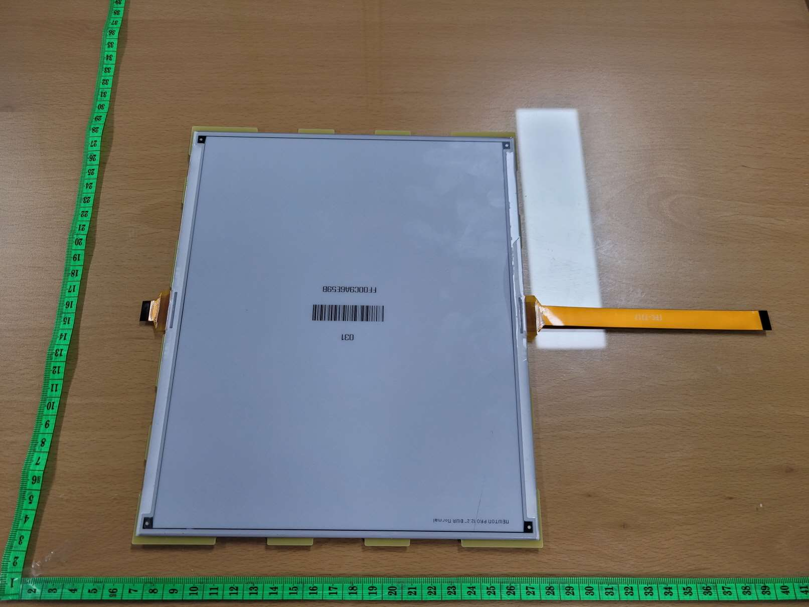
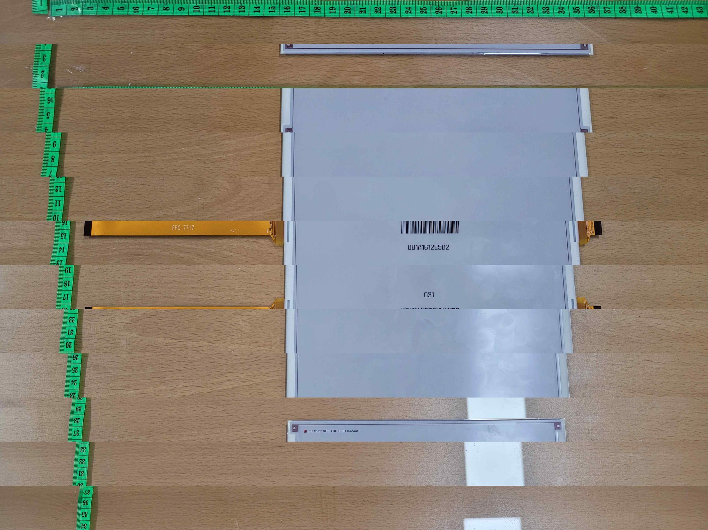

# Identificazione del pannello SOLUM 12.2" — evidenze

Documento di riferimento sull'hardware del pannello pilotato da
[`GxEPD2_SOLUM_122c_960x768.h`](../../src/GxEPD2_SOLUM_122c_960x768.h).
Raccoglie i dati certi (etichette di fabbrica, datasheet, foto del teardown di
certificazione, misure di bring-up) e li tiene separati dalle deduzioni.

## 1. Fonti

| Fonte | Dove |
|---|---|
| Foto interne FCC 12.2" Newton PRO | [`fcc/fcc_2AFWN-EL122H6W4A_internal_photos.pdf`](fcc/fcc_2AFWN-EL122H6W4A_internal_photos.pdf) |
| Foto interne FCC 12.2" Newton Core | [`fcc/fcc_2AFWN-EL122H5CRC_internal_photos.pdf`](fcc/fcc_2AFWN-EL122H5CRC_internal_photos.pdf) — risoluzione più alta |
| Foto interne certificazione FCC 11.6" | [`fcc/fcc_2AFWN-EL116F6W4A_internal_photos.pdf`](fcc/fcc_2AFWN-EL116F6W4A_internal_photos.pdf) |
| Foto interne certificazione FCC 9.7" | [`../097c/fcc/fcc_2AFWN-EL097F6W4A_internal_photos.pdf`](../097c/fcc/fcc_2AFWN-EL097F6W4A_internal_photos.pdf) |
| Datasheet prodotto ESL | [`../Newton-PRO_Data-sheet_C-Lab_G_240320.pdf`](../Newton-PRO_Data-sheet_C-Lab_G_240320.pdf) |
| Datasheet controller | [`../SSD1677_Rev1.0_2018-11_Solomon-Systech.pdf`](../SSD1677_Rev1.0_2018-11_Solomon-Systech.pdf) |

Le pratiche FCC pubblicano foto interne/esterne, manuale d'uso e test report.
Block diagram, schematici e operational description esistono nella stessa
pratica ma sono coperti da confidentiality letter: non sono ottenibili.

## 2. Identità del pannello

**Il 12.2" esiste in due linee di prodotto, con lo stesso pannello.** Le
pratiche FCC del grantee SOLUM ne contengono tre per questa diagonale:

| Pratica | Linea | Scheda tag | Etichetta sul vetro |
|---|---|---|---|
| 2AFWN-EL122H6W4A | Newton **PRO** | `PRO_12.2_Nordic_TAG_R02`, nRF52811 | `Newton PRO 12.2" BWR normal` |
| 2AFWN-EL122H5CRC | Newton **Core** / M3 | `M3_NEWTON_CORE_12.2_TAG_H07`, 2024.02.22 | `M3 12.2" NEWTON BWR Normal` |
| 2AFWN-EL122R2WRN | generazione precedente | — | foto a bassa risoluzione |

Geometria, colori e code sono le stesse in entrambe le linee: cambiano la
scheda tag e il guscio. Quale delle due sia un dato pannello **lo dice
l'etichetta serigrafata sul vetro**, che va letta sull'esemplare in mano;
`normal` distingue la versione non freezer. Il barcode dell'esemplare PRO è
`FF00C9A6E59B`, quello Core `0B1A1612E5D2`, entrambi lotto `031`.

**Come si legge un codice modello SOLUM** (§3.6 "Label Marking" del datasheet
PRO, `../Newton-PRO_Data-sheet_C-Lab_G_240320.pdf`):

```
EL <taglia> <generazione> <colore scocca> <colore display> <tipo tag>
   122       H6            W               4                A
```

`R` nel campo colore = BWR, `4` = RED, YELLOW (BWRY). Attenzione però: nel
datasheet **ogni** taglia della linea PRO è elencata come `...W4A`, quindi la
cifra `4` marca la **linea** (PRO nominalmente a 4 colori, Core `R` a 3) e non
il film della singola unità. La tabella qui sotto lo dimostra: 9.7", 11.6" e
12.2" PRO hanno tutte la cifra `4`, ma la serigrafia sul vetro dice BWRY solo
per la 9.7". **Il colore reale lo dice il vetro, non il codice.** Dettaglio in
[`../fonti_esterne.md` §2](../fonti_esterne.md).

| | 9.7" | 11.6" | **12.2"** |
|---|---|---|---|
| Modello ESL | EL097F6W4A | EL116F6W4A | **EL122H6W4A** |
| FCC ID | 2AFWN-EL097F6W4A | 2AFWN-EL116F6W4A | **2AFWN-EL122H6W4A** |
| Colori (etichetta pannello) | **BWRY** | BWR | **BWR** |
| Risoluzione | 672 × 960 | 640 × 960 | **768 × 960** |
| Densità | 121 dpi | 100 dpi | **102 dpi** |
| Area attiva | 141.1 × 201.6 mm | 163.0 × 244.5 mm | **190.1 × 237.6 mm** |
| Code FFC sul pannello | **1** | **1** | **2** |
| Scheda tag originale | `NEWTON_S 9.7_R01` | `PRO-S116b_11.6_R02` | **`PRO_12.2_Nordic_TAG_R02`** |

Il pitch è quadrato e identico sui due assi del 12.2": 237.6 / 960 =
190.1 / 768 = **0.2475 mm**.

Altri dati dal datasheet C-Lab per il 12.2": label 216.2 × 260.0 × 15.35 mm,
586 g, **6 batterie CR2450** da 3 V. La riga "Display Colors: BWRY" del
datasheet è generica per la linea, con la nota che *color options are not
available for all sizes*: le etichette dei singoli pannelli sono la fonte
attendibile, ed è così che si sa che il **9.7" è BWRY mentre 11.6" e 12.2"
sono BWR**.

-  — le due code FFC, una
  per bordo lungo, entrambe a metà altezza
- [retro del pannello](fcc/122_pannello_retro.jpg) — le due code separate, con
  il COF schermato alla base di ciascuna
- [9.7"](../097c/fcc/097_pannello_fronte.jpg) e [11.6"](fcc/116_pannello_fronte.jpg) —
  coda **singola**, sempre a metà di un bordo lungo
-  —
  la stessa geometria sull'esemplare Core, dove la serigrafia della coda è
  leggibile: **`FPC-7717`**

**Part number delle code**: `FPC-7717` sul 12.2", `FPC-7711` sull'11.6",
`FPC-77xx` sul 9.7". Sono la stessa serie di progetto, il che spiega perchè il
9.7" entri direttamente in un connettore e-paper standard; il conteggio dei
contatti però non è lo stesso fra le taglie (24 sul 9.7", 21 misurati sul
12.2"), quindi la serie non implica pinout identico.

**Le due code escono da bordi opposti, alla stessa altezza.** Verificato sulle
strisce singole delle foto Core, non sul montaggio: nella stessa banda di
altezza una coda esce dal bordo sinistro e una dal destro. Geometricamente le
due sono quindi legate da una rotazione di 180°, e questo è il motivo del
default `setSlaveMirror(true, true)` nel driver. Attenzione al limite di questa
evidenza: la foto fissa la geometria, non l'orientamento elettrico. Se il
fan-out sul vetro incrocia le linee, due COF ruotati possono comunque
scandire nello stesso verso, e allora il mirror va disattivato. Lo decide il
pattern di `dual_panel_finder`, non la fotografia.

## 3. Geometria dello split — confermata al bring-up

Ogni controller pilota **960 × 384**: lo split cade sull'**asse corto** del
pannello (i 768 px / 190.1 mm), non sull'asse lungo. Verificato stampando un
rettangolo 960 × 384 con l'ESP32 cablato su una sola coda FFC.

```
                asse lungo = 237.6 mm = 960 px  (asse SOURCE)
        ┌───────────────────────────────────────────────┐
FFC #1 ─┤            960 × 384  (384 gate)              │
        ├───────────────────────────────────────────────┤  asse corto
        │            960 × 384  (384 gate)              ├─ FFC #2
        └───────────────────────────────────────────────┘  = 190.1 mm
                                                          = 768 px
                                                          (asse GATE)
```

Nel sistema di coordinate del driver (`WIDTH = 960` sull'asse source,
`HEIGHT = 768` sull'asse gate) le due metà sono quindi **bande orizzontali**:
righe 0..383 a un controller, 384..767 all'altro.

La posizione delle code conferma quale asse è quale: su tutti e tre i pannelli
della famiglia la coda si attacca **al centro di un bordo lungo**, cioè al
bordo da 960 px, che è il bordo dei source. Ogni controller serve le linee
gate della metà adiacente al proprio bordo, e ogni gate line attraversa il
pannello per tutti i 960 pixel dell'asse source.

Conseguenza sulla scansione: i due chip partono dal proprio bordo e scandiscono
verso il centro, quindi **una delle due metà va scandita in reverse** perchè le
bande risultino contigue e con lo stesso verso.

## 4. Controller: perchè è SSD16xx e non UC8179

L'**SSD1677** ha **960 source × 680 gate** (datasheet §1: *960 source
outputs, 680 gate outputs, maximum display resolution 960x680*). I 960 source
coincidono esattamente con l'asse lungo di tutta la famiglia Newton PRO, e il
limite di 680 gate spiega da solo il numero di code FFC per taglia:

| Pannello | Gate necessari | Controller | Code FFC osservate |
|---|---|---|---|
| 9.7" 672 × 960 | 672 ≤ 680 | 1 | 1 |
| 11.6" 640 × 960 | 640 ≤ 680 | 1 | 1 |
| **12.2" 768 × 960** | **768 > 680** | **2 × 384** | **2** |

L'**UC8179** arriva a 800 × 600: nessuna delle due spartizioni possibili con
due soli controller ci sta dentro — 960 × 384 sfonda i 800 source, 480 × 768
sfonda i 600 gate. Con due controller un pannello 960 × 768 **non è pilotabile
in UC8179**, quindi la base UC8179 dello scheletro 1248c è da scartare a
prescindere dalle misure.

Sul campo, una metà del pannello stampa correttamente un rettangolo
960 × 384 pilotata come singolo controller di famiglia SSD16xx: il riferimento
di init più vicino è il 9.7" della stessa libreria
([`GxEPD2_SOLUM_097c_960x672.h`](../../src/GxEPD2_SOLUM_097c_960x672.h)), che
è SSD1677 e sullo stesso asse source da 960. Riferimento upstream indipendente
sulla stessa geometria: `epd/GxEPD2_1160_T91` di GxEPD2 (Good Display
GDEH116T91, 960 × 640, SSD1677), il cui init coincide con il nostro tranne
l'ultimo byte del soft start `0x0C` (`0x40` invece del `0x80` di fabbrica
SOLUM) e un `0x22 = 0xB1` + `0x20` in coda.

**L'hardware di cascade sta nel pin table dell'SSD1677 stesso**, solo
classificato come riservato: `M/S#` è dato *"reserved pin, should be connected
to VDDIO"* e `CL` è dichiarato **I/O**, *"should be left open in application"*,
e compare nelle caratteristiche elettriche sia fra i VIH d'ingresso sia fra i
VOH d'uscita — un pin da lasciare aperto non ha bisogno di poter pilotare. Sono
gli stessi due pin che l'SSD1683 §6.12 usa per la cascade. Non è più analogia
con un chip fratello: i pin ci sono nel controller che abbiamo in mano.

## 5. Scheda tag originale (utile come schema di riferimento)

- MCU **nRF52811** (marking `N52811 QFAABO`) sull'esemplare PRO, quindi il tag è
  della generazione nRF di SOLUM. OpenEPaperLink **non copre questa taglia**:
  le definizioni correnti del progetto (`Shared_OEPL_Definitions`) arrivano a
  `STYPE_SIZE_116` (0x65), `STYPE_SIZE_116B` (0x4A) e `STYPE_SIZE_116_BWRY`
  (0x7D), più `STYPE_SIZE_075_BWRY` (0x7B), ma non esiste alcuna voce per il
  12.2"; e il driver `unissd` ha un caso hardcoded solo per 960 × 672. Da
  notare, per la questione del 4° colore sul 9.7": OEPL ha aggiunto varianti
  BWRY per 7.5" e 11.6" e continua a non averne una per il 9.7".
- **Nessun TCON discreto sulla scheda**: i controller sono i COF alla base
  delle due code del pannello. [Lato saldature](fcc/122_pcb_lato_saldature.jpg)
  vuoto, tutti i componenti su [un solo lato](fcc/122_pcb_lato_componenti.jpg).
- **Due connettori FFC identici**, uno per coda. Il conteggio dei contatti dal
  profilo dei pin nelle foto dà ~24, ma è una stima soggetta all'errore di
  scala della fotografia: prevale la misura fisica del cavo, 21 pin, su cui è
  costruita la documentazione di cablaggio in
  [README_122c §8](../../README_122c.md#8-cablaggio-hardware-waveshare-board--esp32-dev-board-generica).
- **I due connettori non sono simmetrici.** Attorno al primo c'è tutta
  l'elettronica analogica — switcher SOT-23, induttore schermato, catena di
  diodi, banco di condensatori:
  [dettaglio](fcc/122_pcb_ffc_con_boost.jpg). Il **secondo è nudo**, senza un
  solo componente attorno, e i suoi pin escono in un fascio di piste parallele
  che arriva dalla zona del primo:
  [secondo connettore](fcc/122_pcb_ffc_secondo.jpg). La stessa asimmetria si
  legge sulla scheda Core, dove le foto sono a 4032 × 3024
  ([scheda intera](fcc/122_core_tag_board_due_FFC.jpg)). Le schede
  [9.7"](../097c/fcc/097_pcb.jpg) e [11.6"](fcc/116_pcb.jpg), single-controller,
  hanno la loro unica rete accanto all'unico connettore.

Questa asimmetria è la firma della **cascade mode** della famiglia SSD16xx: il
chip slave ha oscillatore e booster **disabilitati** e riceve dal master il
clock CL e tutte le tensioni generate. Lo dice il datasheet SSD1683 §6.12
([`SSD1683_Rev1.0_2021-01_Solomon-Systech.pdf`](../SSD1683_Rev1.0_2021-01_Solomon-Systech.pdf)):
*"When the chip is configured as a slave chip, its oscillator and booster &
regulator circuit will be disabled. The oscillator clock and all booster
voltages will come from the master chip. Therefore the corresponding pins
including CL, VDD, VGH, VGL, VSH1, VSH2, VSL, VGL and VCOM must be connected to
the master chip."* Il ruolo lo fissa il pin `M/S#` (VDDIO = master, VSS =
slave), e il master va messo in cascade dal registro `0x21`, secondo parametro,
bit B[4] *ckouten*.

Conseguenza diretta, e spiega il bring-up: **la coda slave non può funzionare da
sola**, per costruzione. Nessun clock, nessuna alta tensione. Il fascio di piste
che va dal primo connettore al secondo è il collegamento di quei rail.

## 6. Perchè la seconda coda resta muta

Stato attuale del bring-up: con l'ESP32 su una coda si stampa 960 × 384
correttamente — è la metà che il firmware di produzione già disegna — mentre
spostando lo stesso cablaggio sull'altra coda non si stampa nulla. Ipotesi in
ordine di probabilità.

0. **È la coda dello slave di una coppia in cascade, e da sola non può
   funzionare.** È la spiegazione che copre tutti i sintomi senza ipotesi
   aggiuntive, ed è sostenuta dall'asimmetria dei due connettori sul tag di
   fabbrica (§5): lo slave non ha oscillatore nè booster, quindi su un breakout
   che gli porta solo SPI e 3.3 V riceve i comandi e non può fare nulla. Ne
   segue anche che il secondo controller non vuole un CS proprio: sul tag c'è
   **un solo chip select** per il pannello, e lo slave si indirizza sommando
   `0x80` all'opcode. Le tre ipotesi che seguono restano possibili, ma spiegano
   solo il silenzio, non il fatto che il tag di fabbrica non abbia nè un secondo
   CS nè un secondo boost.
1. **Pinout della seconda coda ribaltato.** Le due code escono da bordi
   opposti e, se sono la stessa parte, la seconda è ruotata di 180° rispetto al
   pannello: il pin 1 finisce sul lato opposto del cavo. Riusando lo stesso
   orientamento nel connettore, il pin *n* va a cadere sul pin *N+1-n*, cioè
   alimentazioni e SPI atterrano tutte fuori posto. Verifica: continuità dei
   pin di GND della seconda coda rispetto alla prima, a pannello scollegato.
2. **Rail di alta tensione non cablati sul secondo attacco.** Se la prima coda
   sfrutta il connettore della board Waveshare (che porta la rete di
   boost del pannello) e la seconda è stata portata su un breakout con solo
   SPI e 3.3 V, il secondo controller ha logica ma non elettroforesi:
   comportamento identico a "non stampa nulla".
3. **BUSY o RST fuori posizione** sul secondo attacco: il driver si blocca in
   attesa di un BUSY che non viene mai rilasciato, e nessun comando arriva a
   destinazione.

Le tre ipotesi si distinguono con la stessa sessione di multimetro: mappa dei
pin di GND e VCI su entrambe le code, e verifica che i pin di boost siano
cablati anche sul secondo attacco.

## 7. Cosa resta aperto

| Punto | Stato |
|---|---|
| Colori | **chiuso**: BWR, nessun giallo — lo dice la serigrafia sul vetro (`Newton PRO 12.2" BWR normal`), che prevale sulla cifra `4` del codice modello, costante su tutta la linea PRO |
| Geometria per controller | **chiuso**: 960 × 384, split sull'asse corto |
| Famiglia del controller | **chiuso in pratica**: SSD16xx, base di init dal 9.7". Il fratello a 4 colori della stessa taglia (SSD2677, 960 × 680, RAM a 2 bit/pixel) parla invece UC: non è questo |
| Part number esatto del controller | aperto: nessuna serigrafia leggibile, il COF è schermato. Si chiuderebbe leggendo `0x2E` (User ID da OTP), che richiede un SDO: il connettore interno della board non lo porta, la coda cablata a mano forse sì — vedi il punto 7 in testa a `examples/12_2c/dual_panel_finder` |
| Quale metà è quale coda | aperto: da annotare al bring-up del secondo controller |
| Verso della scansione della seconda metà | aperto: una delle due va in reverse |
| Alimentazione della seconda coda | **chiuso in pratica**: nessun boost sul secondo connettore, i rail arrivano dal primo — cascade mode, §5 |
| Indirizzamento del secondo controller | opcode `\|0x80` su un solo CS, più `0x21` B[4] = 1 sul master: da verificare sul pannello |
| Ordine dei pin sulla seconda coda | aperto: possibile ribaltamento, vedi §6 |
